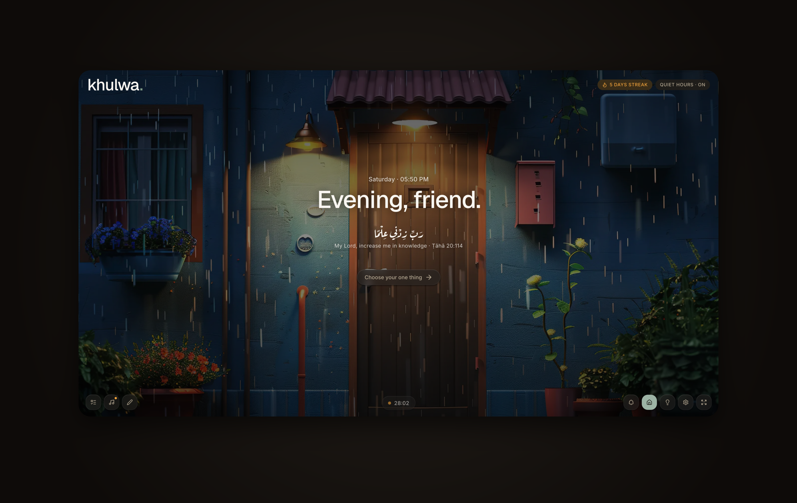
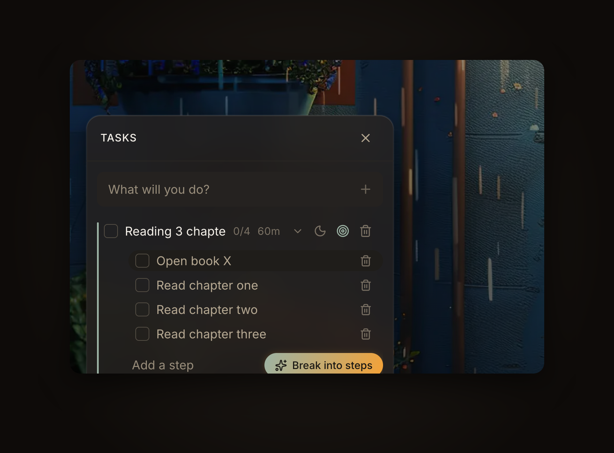
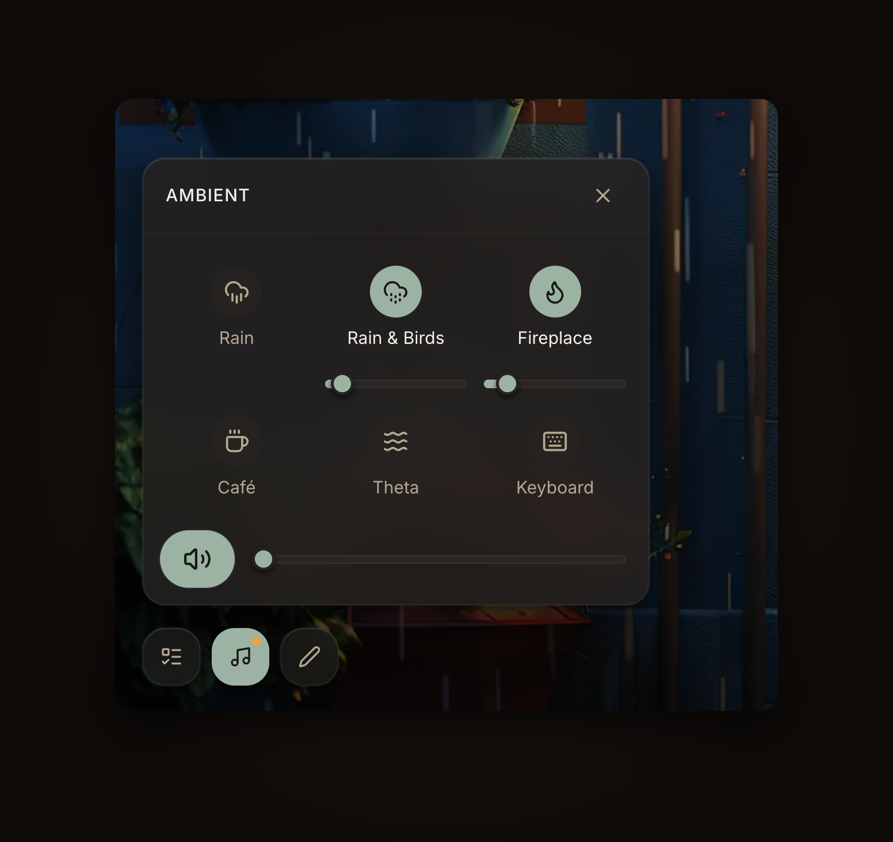
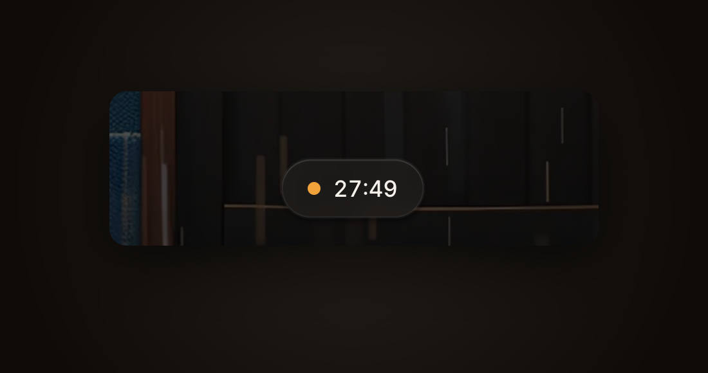
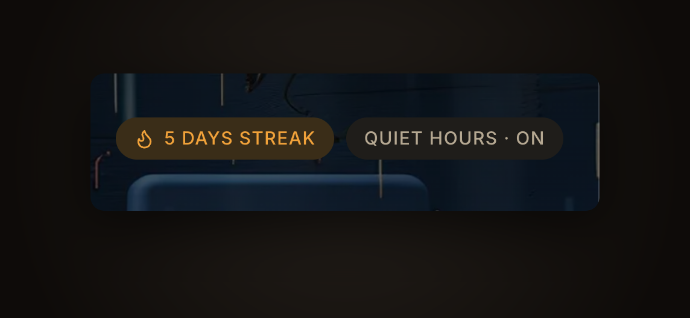

<div align="center">



<br/>

# خَلوة · Khulwa

**A retreat for deep work.**

A quiet room, a verse, a timer, one task — and nothing else.

<p>
  <a href="https://github.com/khulwa-app/khulwa/stargazers"></a>
  
  
  
  
  
</p>

</div>

---

## What is Khulwa

**Khulwa** (Arabic: خَلوة, *sacred solitude*) is a focus environment for deep work — built on the Pomodoro technique and the Sufi tradition of retreat. It is bilingual (Arabic / English, RTL-aware) and deliberately calm: a warm, single-light theme, soft glass chrome, and no clutter competing for your attention.

You enter a **space**, set your **one thing**, start the **timer**, and let a quiet **ambient bed** hold the room. Everything else stays out of the way.

---

## A look inside

<table>
  <tr>
    <td width="50%" valign="top">
      
      <br/>
      <sub><b>Tasks, quietly.</b> Capture in one line, break a big task into steps — by hand or with one AI tap. Today / Later / Done, in-place editing, actions revealed on hover.</sub>
    </td>
    <td width="50%" valign="top">
      
      <br/>
      <sub><b>An ambient bed.</b> Layer rain, fireplace, café and more — each with its own volume and a master, smooth fades, loudness-normalized loops that keep playing across spaces.</sub>
    </td>
  </tr>
</table>

<div align="center">
  
  <br/>
  <sub><b>The session follows you.</b> A quiet floating timer keeps a running Pomodoro in sight from any space.</sub>
  <br/><br/>
  
  <br/>
  <sub><b>Gentle chrome.</b> A focus streak and quiet hours rest at the edge of the screen — present, never nagging.</sub>
</div>

---

## Features

### Three spaces
Photo-backed, URL-driven environments you move between — **Home** (arrival & intention), **Focus** (the timer), and **Ambient** (rest). The chrome floats over each scene as one cohesive glass family.

### The home ritual
A live clock and a **time-aware greeting** (*Morning / Evening, friend*), a **rotating Qur'anic āyah** drawn from a curated collection on knowledge and perseverance (with translation + citation, AR & EN), and a **"your one thing"** card — pick a task and step through to Focus.

### Focus & the Pomodoro
Full Pomodoro flow — focus, short break, long break, rounds — with phase tabs and a large, calm timer. The task you're focused on is **whispered beneath the clock**, and a **floating timer pill** follows you to other spaces so a running session is never out of sight.

### Tasks
A store-driven, deliberately compact task panel: **one-line quick capture**, **subtasks (steps)**, a **Today / Later / Done** rhythm, in-place editing, and a single doing-now focus per the app's one-thing ethos. Rows stay calm at rest and reveal their actions on hover.

### AI assist · *optional, quiet*
Powered by **Gemini**, and built to work **fully with AI off**:
- **ETA estimation** — a realistic time estimate is filled in the background as you capture a task (never overriding a value you set).
- **Break into steps** — turn a vague, heavy task into 3–5 concrete steps with one tap.

### Ambient sounds
A layered **soundscape mixer** — rain, rain & birds, fireplace, café, theta, keyboard — each with its own volume plus a master, **smooth fades** on play/pause, and loudness-normalized loops. Your levels persist; the audio keeps playing across spaces, and the dock shows a quiet dot while it's on.

### Bilingual & calm by design
Arabic and English, RTL-aware throughout. A token-driven **Chakra UI v3** design system — warm dark palette (saffron + sage), shared glass material, one source of visual truth in `client/theme/`.

---

## Roadmap

Building toward a focus companion that reflects with you, not at you.

- **AI** — smart natural-language capture (*"read 20 pages before maghrib, high priority"* → fields), a calm **daily closing summary**, **weekly focus insight**, session intention phrasing, and verse rotation by theme.
- **Sessions** — link the Pomodoro to the doing-now task, then turn session history into gentle reflections.
- **Sounds** — seamless crossfade loops, saved **scenes/presets**, and resume-on-gesture after a refresh.
- **Sync** — auth pages + persistence to the server, streaks, and quiet-hours scheduling.

---

## Tech stack

### Client (`client/`)

| Concern | Library |
|--------|--------|
| Framework | Next.js 16 (App Router, Turbopack) |
| UI | Chakra UI v3 — token-driven, recipe & slot-recipe based |
| State | Zustand (persisted stores: tasks, pomodoro, sounds) |
| Audio | react-howler / Howler.js (Web Audio, gapless loops) |
| AI | `@google/genai` (Gemini) via server actions |
| i18n | next-intl + JSON messages (cookie locale, AR default) |
| Auth | `better-auth/react` — cookie sessions, email/password + Google |
| Fonts | Reem Kufi (display) · IBM Plex Sans Arabic (body) · IBM Plex Sans (tabular numerics) |

### Server (`server/`)

| Concern | Library |
|--------|--------|
| Runtime | Node 20+ · Express 5 · TypeScript (NodeNext) |
| DB | Postgres (Neon) · Drizzle ORM |
| Auth | Better Auth — email/password + Google OAuth, sessions in DB |
| Email | Resend |

---

## Monorepo layout

```
khulwa/
├── client/        Next.js 16 · Chakra UI v3 · Zustand · next-intl · Gemini
│   ├── modules/   spaces · tasks · pomodoro · sounds · verses · ai · dock · panels
│   ├── theme/     tokens · semantic-tokens · recipes · slot-recipes · layer-styles
│   └── messages/  ar.json · en.json
├── server/        Express 5 · Drizzle · Postgres · Better Auth · Resend
└── docs/          screenshots for this README
```

Each app is self-contained — no root `package.json`, no workspaces (yet).

---

## Quick start

**Prereqs:** Node ≥ 20.9 · Yarn (client) · npm (server) · Postgres (Neon free tier) · optional Google OAuth, Resend, and `GEMINI_API_KEY` for AI assist.

```bash
git clone git@github.com:khulwa-app/khulwa.git
cd khulwa
```

**Server**
```bash
cd server
npm install
cp .env.example .env.local      # DATABASE_URL, BETTER_AUTH_SECRET, optional GOOGLE_*/RESEND_*
npm run db:push                 # apply Drizzle schema
npm run dev                     # http://localhost:4000
```

**Client**
```bash
cd client
yarn install
cp .env.example .env.local       # NEXT_PUBLIC_BACKEND_URL=http://localhost:4000
# optional: GEMINI_API_KEY=...  (AI assist; the app runs fine without it)
yarn dev                         # http://localhost:3001
```

### Ambient sound assets
Processed loops live in `client/public/sounds/`. To re-encode from sources in `client/assets/sounds/` (two-pass EBU R128 loudness normalization → Opus), run:

```bash
cd client && ./scripts/process-sounds.sh   # requires ffmpeg
```

---

## Design system

`client/theme/` is the single source of visual truth — **tokens only**, no raw hex, no inline font stacks, no magic `px`.

- **tokens / semantic-tokens** — palette (saffron, sage, sand, night), `bg.*` `fg.*` `border.*`, shadows, durations
- **layer-styles** — the shared glass material (dock, pills, panels, cards)
- **recipes / slot-recipes** — Button, plus compound components for the dock, panels, task list, sound grid, timer pill
- **system.ts** — composed Chakra system, `cssVarsPrefix: "khulwa"`

After any theme change: `yarn typegen`.

### Commands

| | Client (`yarn`) | Server (`npm`) |
|---|---|---|
| Dev | `yarn dev` | `npm run dev` |
| Build | `yarn build` | `npm run build` |
| Lint | `yarn lint` | — |
| Types | `yarn typegen` | — |
| DB | — | `npm run db:push` · `db:studio` |

---

## License

Private — see [LICENSE](LICENSE), or contact the org.

<div align="center">
  <br/>
  <sub>Built quietly. Use intentionally.</sub>
</div>
