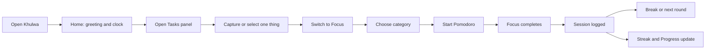

# Phase 0 Review — Experience Baseline

Status: ready for product-direction review. No production UI has been changed.

## Final UI stack constraint

The completed redesign must contain only Tailwind CSS and DaisyUI for the UI
layer. Chakra UI, Emotion, Chakra providers, recipes, slot recipes, generated
types, typegen scripts, and Chakra-specific lint rules must all be removed.

## What was inspected

- Landing at desktop and mobile widths.
- Authenticated Home at desktop and mobile widths.
- Home → Focus transition.
- Focus at desktop and mobile widths.
- Tasks, Notes, Music, Rhythm, and Settings panels.
- Progress at desktop and mobile widths.
- Ambient space.

Baseline captures live in [`baseline/`](baseline/).

## Primary evidence

### 1. Responsive composition is currently broken

- At 1440 px, the landing hero is shifted beyond the right edge.
- At 375 px, the landing headline and navigation are heavily clipped.
- The authenticated workspace occupies only part of the captured viewport,
  leaving a large white strip at the right edge.
- Mobile Progress renders as a blank white viewport.

### 2. Space switching creates an interruption

Immediately after Home → Focus, the central experience disappears into a white
frame before Focus content arrives. The current space layer waits before its
entrance animation, so users perceive a reset rather than spatial continuity.

### 3. Initial content is delayed

Home initially renders its environment and chrome without the greeting, clock,
or date. Those primary elements appear roughly one second later. The first
meaningful frame therefore lacks the screen's actual purpose.

### 4. The visual language is fragmented

- Home and Focus use the green immersive field.
- Progress uses an unrelated pale dashboard surface.
- Tasks, Notes, Music, and Rhythm mix very dark panels with bright white rows.
- Settings uses a large dark sheet with extremely low-contrast content.
- Primary controls, cards, navigation chips, and fields do not share a clear
  elevation or interaction system.

### 5. Hierarchy and typography do not feel professional

- Nunito gives controls and headlines a rounded, casual character.
- The clock dominates Home, but supporting hierarchy is too weak.
- Focus controls are visually disconnected vertically.
- Small uppercase labels and low-opacity text become hard to read.
- The typography system changes character between immersive screens and Progress.

### 6. Secondary tools feel attached, not integrated

The bottom-left tool dock, bottom-right space dock, top navigation, streak badge,
and floating panels behave as separate islands. Panels cover content without a
strong spatial relationship to their trigger or to the current task.

## Current journey



The product logic is sound. The redesign should shorten the perceived journey:
the selected task, session state, and next meaningful action should remain
visible and connected rather than living in separate panels.

## Proposed experience model

### Desktop

```text
┌──────────────────────────────────────────────────────────────────────┐
│ Brand / context                                      streak · profile │
│                                                                      │
│                         CURRENT MODE                                 │
│                  greeting / task / timer                             │
│                  one clear primary action                            │
│                                                                      │
│            contextual task or sound detail when needed               │
│                                                                      │
│  tools                 Home · Focus · Ambient              settings  │
└──────────────────────────────────────────────────────────────────────┘
```

- The environment is the canvas.
- Mode content owns the center.
- Navigation is stable and quiet.
- Tools expand from their trigger without replacing the environment.
- The doing-now task persists across Home and Focus.

### Mobile

```text
┌──────────────────────────────┐
│ context            streak    │
│                              │
│        CURRENT MODE          │
│       primary content        │
│       primary action         │
│                              │
│ contextual bottom sheet      │
│ when a tool is requested     │
│                              │
│ Home    Focus    Ambient     │
└──────────────────────────────┘
```

- Three destinations maximum in persistent navigation.
- Tasks, sound, progress, and settings open as purposeful sheets or routes.
- No desktop dock compressed into a mobile toolbar.

## Direction A — Sage Serenity

Comfortable, restorative, recognizable, and still professional. This is the
recommended direction after the sage reference review.

- A light sage experience field surrounded by quieter tinted whitespace.
- The supplied ten-step sage scale is used across structure, selection, focus,
  text, and primary action rather than as a decorative accent.
- Neutral sans typography: Inter, Geist, or Instrument Sans.
- Mono or tabular companion for timer and statistics.
- Deep forest-green primary action and typography.
- White utility surfaces provide breathing room inside the green environment.
- Solid tonal blocks create visual interest without gradients or glow.
- Crisp controls and lower corner radius than the current system.
- Best fit for a premium focus instrument and closest to the desired Flocus-level
  polish without copying Flocus.

Risk: too much pale green would feel medicinal, while too much dark green would
feel heavy. White elevated surfaces and the full tonal scale keep it balanced.

## Direction B — Alabaster and Ink

Warm, light, precise, and quietly luxurious. This remains available as a neutral
comparison.

- Warm alabaster canvas with porcelain-white working surfaces.
- Graphite primary action and typography.
- Aged-brass detail reserved for focus, selection, and status.
- Solid, tactile utility surfaces with subtle depth.
- No gradients, colored glow, or ornamental color washes.
- Elegant and quiet, but less ownable than the sage direction.

Risk: without environmental color, it can return to the neutral minimalism that
felt too restrained.

## Premium color decision

The base product is near-monochrome and light-first. Color is not decoration and
must never be used as a substitute for hierarchy.

### Recommended Sage Serenity palette

| Role | Value | Use |
| --- | --- | --- |
| Canvas | `#EDF3EB` | Tinted workspace whitespace |
| Experience field | `#D5E3D5` | Home, Focus, and Ambient canvas |
| Selected | `#B7D1B1` | Active navigation and selected containers |
| Border | `#9BC09A` | Quiet structure |
| Supporting field | `#7DA87A` | Progress and secondary visualization |
| Focus state | `#5A8F5B` | Focus borders and meaningful active state |
| Support tone | `#4E7D4F` | Charts and non-text semantic fills |
| Supporting text | `#3C6B3E` | Metadata and labels |
| Secondary text | `#2B5930` | Supporting copy |
| Primary text | `#1A4722` | Headings, timer, and primary content |
| Primary action | `#0B3515` | One dominant action per view |
| Elevated | `#FBFDF9` | Panels, cards, and persistent navigation |
| Action text | `#F7FBF5` | Text on the primary action |

Target proportion: 55–65% pale sage environment, 20–30% near-white elevated
surfaces, and 10–15% deep forest structure and action. Mid-sage tones are
reserved for selection, progress, and focus state so the interface feels alive
without becoming visually busy.

### Alabaster and Ink alternative

| Role | Value |
| --- | --- |
| Canvas | `#F3F0E9` |
| Surface | `#FAF8F3` |
| Elevated | `#FFFFFF` |
| Border | `#D9D4C9` |
| Primary text | `#1C1B18` |
| Secondary text | `#5F5B54` |
| Muted text | `#706B63` |
| Primary action | `#24231F` |
| Focus detail | `#8B6F47` |

Primary, secondary, muted, action, and focus-detail text combinations all meet
at least 4.5:1 contrast on their intended surfaces.

Success, warning, danger, and active audio/focus signals may use one muted
semantic color each, only where meaning cannot be carried by text and icon.
Environmental scene art can introduce color later, but the interface chrome
remains near-monochrome. Gradients are excluded from the design system.

## Typography shortlist

The side-by-side body, display, control, timer, and statistics specimen is in
[`directions/type-specimen.svg`](directions/type-specimen.svg).

### Recommended default

- Interface and display: Instrument Sans or Geist Sans.
- Timer and statistics: Geist Mono or the sans family with tabular numerals.
- Weights: 400 body, 500 controls, 600 headings, 650–700 only for major emphasis.

### Alternative

- Interface: DM Sans.
- Reflection accent: Instrument Serif.
- Timer: Geist Mono.

Nunito, Poppins, decorative luxury serifs, and heavily rounded geometric fonts
are excluded.

## Motion contract

- No entrance delay for primary content.
- Preserve the outgoing environment until the incoming mode is ready.
- Crossfade environmental layers over 240–320 ms.
- Move mode content 8–12 px with opacity over 180–240 ms.
- Enter with ease-out; exit faster with ease-in.
- Panels expand from their trigger or rise from the bottom on mobile.
- Never animate layout dimensions for primary transitions.
- Never animate the timer each second.
- Reduced motion removes travel and uses a short opacity change only.

An interactive comparison is available at
[`public/redesign/phase-0-motion.html`](../../public/redesign/phase-0-motion.html).

## Critical-flow verification

- [ ] Home renders greeting, clock, and date in the first meaningful frame.
- [ ] Home → Focus never exposes the document background.
- [ ] Focus → Home keeps a running timer visible.
- [ ] Opening one tool closes or replaces the previous tool predictably.
- [ ] Escape closes the deepest active layer first.
- [ ] Selecting a doing-now task updates Home and Focus immediately.
- [ ] Completing Focus logs once and updates streak/progress.
- [ ] Audio continues across mode and route changes.
- [ ] Desktop works at 1024 and 1440 px without clipping.
- [ ] Mobile works at 375 px without horizontal overflow.
- [ ] Keyboard, touch, and reduced-motion paths remain complete.

## Phase 0 review decisions

1. Confirm Sage Serenity or return to Alabaster and Ink.
2. Choose the typography direction.
3. Confirm light-first or request a future dark companion theme.
4. Confirm the desktop and mobile information architecture.
5. Confirm the motion contract.
